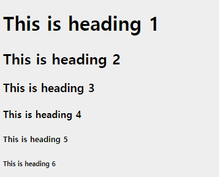
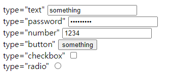

# HTML 기본


## HTML 문서의 구조

HTML의 기본 구조는 아래와 같습니다.

```html
<!DOCTYPE html>
<html>
    <head>
        <!-- ... -->
    </head>
    <body>
        <!-- ... -->
    </body>
</html>
```

웹에서는 태그`<something>`라는 개념을 사용합니다.

대부분의 태그는 여는 태그`<>`와 닫는 태그`</>` 쌍으로 구성됩니다. ex) `<div> </div>`

내용이 없는 태그는 스스로 닫는 `<input />` 같은 형태로도 사용됩니다.

주석을 표현할 때에는 `<!-- 내용 --> ` 형태로 사용합니다.


아래는 https://web.esllo.com의 html 파일 내용입니다.

```html
<!DOCTYPE html>
<html lang="ko">
<head>
  <meta charset="UTF-8">
  <meta http-equiv="X-UA-Compatible" content="IE=edge">
  <meta name="viewport" content="width=device-width, initial-scale=1.0">
  <title>WEB DEV</title>
</head>
<body>
  <h1>Test Web Server</h1>
  <h2>Server Info</h2>
  <h3>Centos 7.9</h3>
  <h3>Nginx 1.20.2</h3>
  <a href="./days/">날짜 별 자료</a>
</body>
</html>
```


#### \<!DOCTYPE html>

DOCTYPE은 문서의 버전을 나타냅니다. 과거에는 HTML 4.01, XHTML 1.0 등이 사용되었으며 현재에는 HTML5 버전이 가장 많이 사용됩니다.

예시로 HTML 4.01의 종류로는 아래가 있습니다.

- HTML 4.01 Strict

  \<!DOCTYPE HTML PUBLIC "-//W3C//DTD HTML 4.01//EN" "http://www.w3.org/TR/html4/strict.dtd">

- HTML 4.01 Transitional

  \<!DOCTYPE HTML PUBLIC "-//W3C//DTD HTML 4.01 Transitional//EN" "http://www.w3.org/TR/html4/loose.dtd">

- HTML 4.01 Frameset

  \<!DOCTYPE HTML PUBLIC "-//W3C//DTD HTML 4.01 Frameset//EN" "http://www.w3.org/TR/html4/frameset.dtd">


하지만 위의 타입은 더이상 주로 사용되지 않으며 새로 작성되는 페이지는 대부분 HTML5를 따릅니다.

HTML5의 DOCTYPE은 `<!DOCTYPE html>` 형태로 사용합니다.


#### \<html>\</html>

html의 전체를 감싸는 태그로 주로 head, body등의 자식으로 구성됩니다.


#### \<head>\</head>

주로 렌더링 되지 않는 HTML의 헤더와 관련된 내용을 가지고 있습니다.

meta, script, link 등의 태그가 주로 자식으로 사용되며 문서의 제목을 뜻하는 title도 사용됩니다.


#### \<body>\</body>

주로 렌더링 되는 HTML의 문서 본문을 표현하는데 사용됩니다.

h1 ~ h6, div, p, span 등의 태그를 자식으로 사용됩니다.


## HTML의 기본 태그

html의 각 태그는 요소(element)를 표현하기 위한 문법입니다.

### h1 ~ h6

HTML에서 헤딩을 표현하기 위해 사용됩니다.

h1이 가장 큰 제목을 뜻하며 h6가 가장 작은 단위입니다.

```html
<!-- ... -->
   <body>
      <h1>This is heading 1</h1>
      <h2>This is heading 2</h2>
      <h3>This is heading 3</h3>
      <h4>This is heading 4</h4>
      <h5>This is heading 5</h5>
      <h6>This is heading 6</h6>
   </body>
<!-- ... -->
```

위의 구조에서는 아래와 같이 표현됩니다.




### p

문단을 표현할 때에는 p 태그를 사용합니다.

기본적으로 p 태그는 문단을 표현하며 블럭 단위입니다. 

```html
<p>이것은 하나의 문단입니다.</p>
```


### br

줄바꿈을 위한 태그로는 br을 사용합니다.

br은 내용이 없는 태그로 스스로 닫을 수 있습니다. 

```html
<p>이것은 하나의 문단입니다.<br/>여기서 부터는 줄이 바뀝니다.</p>
```


### center

내용을 가운데 정렬할 때에는 center 태그를 사용합니다.

```html
<center>
  <p>이 문단은 가운데 정렬 됩니다.</p>
</center>
```


### pre

HTML에서는 기본적으로 탭, 엔터, 스페이스 등이 원하는 대로 동작하지 않습니다.

스페이스나 탭을 위한 이스케이프 문자열 `&tab;`,`&nbsp;` 등을 사용할 수 있지만 pre 태그를 사용하면 pre 안에서는 표기한 그대로 표현됩니다.

```html
<pre>
  이 텍스트는 '       ' 긴 띄어쓰기와 '	'탭
  '
  
  '
  엔터가 그대로 적용됩니다.
</pre>
```


### hr

가로줄을 표현할 때에는 hr 태그를 사용합니다.

문단의 제목과 내용을 구분하는 등의  선이 필요할 때 주로 사용됩니다.

hr도 내용이 없으므로 스스로 닫을 수 있습니다.

```html
<hr/>
```


### div

구역의 나눔을 표현하기 위해서는 div를 사용합니다.

주로 블럭 단위의 콘텐츠를 표현할 때 사용합니다.

```html
<div>
    <h1>
        제목 1
    </h1>
    <p>
        내용 1
    </p>
</div>
<div>
    <h1>
        제목 2
    </h1>
    <p>
        내용 2
    </p>
</div>
```


### span

HTML에서 한줄의 구문 콘텐츠를 위해선 span을 사용합니다. span은 인라인 형태로 줄을 바꾸지 않습니다.

```html
<span>이 것은 하나의 내용입니다.</span>
```


### i

이태릭체의 글을 표현할 때에는 i를 사용합니다.

```html
<i>italic 글씨체</i>
```


### b

두꺼운 글씨를 표현할 때에는 b 태그를 사용합니다.

```html
<b>이 것은 두꺼운 글씨입니다.</b>
```


### img

HTML에서 이미지를 표현할 때 사용합니다.

src라는 속성을 통해 주소를 받아 이미지를 표현합니다.

```html

```


### input

HTML에서 입력을 받을 때에는 input을 사용합니다.

type 속성에 따라 다양한 형태의 입력을 받을 수 있습니다.

```html
<input type="text" />
<input type="password" />
<!-- ... -->
```





### button

HTML에서 클릭을 위한 버튼으로는 button을 사용합니다.

```html
<button> 버튼 </button>
```


## HTML 태그의 중첩

HTML 태그는 기본적으로 중첩하여 표현할 수 있습니다.

```html
<html>
    <head>
        
    </head>
    <body>
        
    </body>
</html>
```

html 아래에 head나 body 를 표현하는 방식 등이 중첩에 해당합니다


```html
<span>이 것은 <i>하나의</i> <b>문장</b>입니다.</span>
```

위의 구문은 아래와 같이 표현됩니다.

이 것은 *하나의* **문장**입니다.


## HTML 태그의 속성

HTML 태그에는 속성이 사용될 수 있습니다.

속성은 `<태그명 {key}={value}> </태그명>` 형태로 사용되며 여러개의 속성을 가질 수 있습니다.

```html
<div id="redBlock" class="block red"></div>
```


### id

id는 해당 요소가 고유한 경우에만 사용합니다.

여러개의 요소가 하나의  id를 참조해도 오류가 발생하지는 않지만 이는 잘못된 사용입니다.


### class

class는 스타일을 적용할 때 주로 사용되며 같은 규칙이 있는 집단을 표현할 때 주로 사용됩니다.

```html
<p class="paragraph red">
    
</p>
<p class="paragraph blue">
    
</p>
<div class="block red">
    
</div>
<div class="block blue">
    
</div>
```


### style

style 속성은 인라인 속성을 적용할 때 사용합니다.

```html
<p style="color:red; padding: 8px 16px;"></p>
```


### alt

alt 속성은 이미지를 표현할 수 없는 경우의 대체 텍스트를 의미합니다.

시각 장애인이 스크린 리더를 통해 내용을 읽거나, 이미지를 그릴 수 없는 환경에서는 대체 텍스트가 사용됩니다.

```html

```

