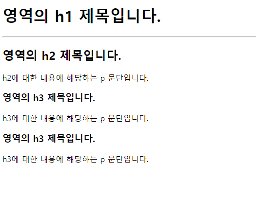
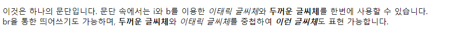

# HTML 맛보기

HTML 태그를 실제로 사용해봅니다.


## 헤딩과 문단





위의 이미지와 같은 화면이 나오도록 태그를 작성해보세요.


위의 화면을 구현하기 위해서는 아래와 같이 작성할 수 있습니다.

```html
  <body>
    <h1>영역의 h1 제목입니다.</h1>
    <hr />
    <h2>영역의 h2 제목입니다.</h2>
    <p>h2에 대한 내용에 해당하는 p 문단입니다.</p>
    <h3>영역의 h3 제목입니다.</h3>
    <p>h3에 대한 내용에 해당하는 p 문단입니다.</p>
    <h3>영역의 h3 제목입니다.</h3>
    <p>h3에 대한 내용에 해당하는 p 문단입니다.</p>
  </body>
```


## 인라인 태그 중첩





위의 이미지와 같은 화면이 나오도록 태그를 작성해보세요.


위의 화면을 구현하기 위해선 아래와 같이 작성할 수 있습니다.

```html
  <body>
    <p>
      이것은 하나의 문단입니다. 문단 속에서는 i와 b를 이용한
      <i>이태릭 글씨체</i>와 <b>두꺼운 글씨체</b>를 한번에 사용할 수 있습니다.
      <br />br을 통한 띄어쓰기도 가능하며, <b>두꺼운 글씨체</b>와
      <i>이태릭 글씨체</i>를 중첩하여 <b><i>이런 글씨체</i></b
      >도 표현 가능합니다.
    </p>
  </body>
```


