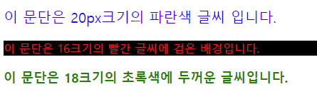
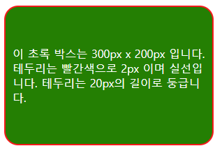

# CSS 기본

CSS는 HTML의 구조에 스타일을 입히기 위해 사용됩니다.


## CSS 의 구조

CSS는 아래와 같은 구조를 하고 있습니다.

```css
선택자 {
    속성키: 속성값;
    속성키: 속성값;
    /* ... */
}
```


CSS 선택자로는 주로 태그, 아이디, 클래스가 사용됩니다.

```css
p {
    /* 이 태그는 p 태그에 빨간 글씨를 적용합니다. */
    color: red;
}

.someClass{
    /* 이 태그는 someClass 클래스를 가진 태그 전체에 파란 글씨를 적용합니다. */
    color: blue;
}

#someId{
    /* 이 태그는 someId 아이디를 가진 태그에 초록 글씨를 적용합니다. */
    color: green;
}
```


## CSS의 위치

css는 아래의 방법으로 사용이 가능합니다.

- 태그에 인라인으로 넣는 방법

```html
<p style="color: red;">인라인 방식</p>
```


- style 태그에 명시하는 방법

```html
<style>
    p{
        color: red;
    }
</style>
<p>
    style 태그 방식
</p>
```


- 별도의 css 파일에 명시 후 link로 연결하는 방법

```css
/* style.css */
p{
  color: red;
}

/* index.html */
<!-- ... -->
    <head>
      <link rel="stylesheet" href="style.css" />
    </head>
    <body>
      <p>외부 css 파일 방식</p>
    </body>
<!-- ... -->
```


## 색상 단위

CSS에서는 RGB(%, Abs), HSL, HEX(Short, Std), Keyword 등이 사용됩니다.

| 색상 타입 | 색상 값                                     |
| --------- | ------------------------------------------- |
| RGB %     | rgb(50%, 20%, 40%), rgb(50%, 20%, 10%), ... |
| RGB Abs   | rgb(0, 0, 0), rgb(255, 0, 125), ...         |
| HEX Std   | #FFFF00, #F0F0F0, ...                       |
| HEX Short | #FFF, #000, #AC0, ...                       |
| Keyword   | red, blue, green, aqua...                   |


## 주로 사용되는 속성 및 맛보기

### color

해당 요소의 글자 색상을 지정합니다

```css
<p style="color: red;">이 것은 빨간 텍스트 입니다.</p>
```


### background

해당 요소의 배경 색상을 지정합니다.

```css
<p style="background: green;">이 것의 배경은 초록색 입니다.</p>
```


### font-size

해당 요소의 폰트 크기를 지정합니다.

```css
<p style="font-size:20px;">이 텍스트는 20px 크기입니다.</p>
```


### font-weight

해당 요소의 폰트 두께를 지정합니다. b태그의 두꺼운 글씨처럼 동작합니다.

```css
<p style="font-weight: bold;">이 텍스트는 두꺼운 글씨입니다.</p>
```


### width

해당 요소의 너비를 지정합니다.

```css
<p style="width: 200px;">이 요소는 너비가 200px 입니다.</p>
```


### height

해당 요소의 높이를 지정합니다.

```css
<p style="height: 100px;">이 요소는 높이가 100px 입니다.</p>
```


### border

해당 요소의 테두리를 지정합니다.

```css
<p style="border: 1px solid red;">이 태그는 빨간 테두리를 갖고 있습니다.</p>
```


### border-radius

해당 요소의 테두리의 둥근 정도를 지정합니다.

```css
<p style="border: 1px solid red; border-radius: 20px;">이 태그의 빨간 테두리는 20px 만큼 둥급니다.</p>
```


### display

해당 요소의 표기 방식을 지정합니다.

기본적으로 div, p 등은 block을 가지고 있고 span b i 등은 inline을 가지고 있습니다.

이외로 flex, grid, inline-block, table 등의 값이 있고 none이 오면 요소가 보이지 않습니다.

```html
<p style="display: inline-block;"> 이 태그는 inline-block 형태입니다. </p>
```


## 아이디와 클래스를 통한 지정

CSS 속성은 아이디와 클래스를 통해 지정할 수 있습니다.

아이디의 지정자는 `#`을 사용합니다.

```css
<style>
#green{
    color: green;
}
</style>
<p id="green">이 텍스트는 초록색 텍스트입니다.</p>
```


클래스의 지정자는 `.`을 사용합니다.

```css
/* style.css */

.red{
    color: red;
}

/* index.html */

<!-- ... -->
<link rel="stylesheet" href="style.css"/>
<!-- ... -->
<p class="red">이 텍스트는 빨간 텍스트 입니다.</p>
<!-- ... -->
```


# CSS 맛보기

CSS 를 실제로 사용해봅니다.


## 글자 꾸미기





위의 이미지와 같은 화면이 나오도록 스타일을 작성해보세요.


위의 화면을 구현하기 위해서는 아래와 같이 작성할 수 있습니다.

```html
  <style>
    .blue-20{
      color: blue;
      font-size: 20px;
    }
    .red-16-black{
      color: red;
      font-size: 16px;
      background: black;
    }
    .green-18-bold{
      color: green;
      font-size: 18px;
      font-weight: bold;
    }
  </style>
  <p class="blue-20">이 문단은 20px크기의 파란색 글씨 입니다.</p>
  <p class="red-16-black">이 문단은 16크기의 빨간 글씨에 검은 배경입니다.</p>
  <p class="green-18-bold">이 문단은 18크기의 초록색에 두꺼운 글씨입니다.</p>
```


## 크기와 색상 테두리





위의 이미지와 같은 화면이 나오도록 태그를 작성해보세요.

글씨의 여부, 색이나 위치는 무시해도 됩니다.


위의 화면을 구현하기 위해서는 아래와 같이 작성할 수 있습니다.

```html
  <style>
    .box{
      width: 300px;
      height: 200px;
      background: green;
      border: 2px solid red;
      border-radius: 20px;
      display:flex;
      justify-content: center;
      align-items: center;
      color: white;
      padding: 10px;
      box-sizing: border-box;
    }
  </style>
  <div class="box">
    이 초록 박스는 300px x 200px 입니다.
    <br/>
    테두리는 빨간색으로 2px 이며 실선입니다.
    테두리는 20px의 길이로 둥급니다.
  </div>
```

