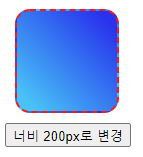

# JS 맛보기


## 폰트 색상 바꾸기


아래의 내용을 구현해 보세요.

```html
<p>
  이 태그는 초록색 입니다.
</p>
<p id="redId">
  이 텍스트는 빨간색 입니다.  
</p>
<p class="blueClass">
  이 텍스트는 파란색 입니다.
</p>
<script>
// 여기를 채워서 위의 두 태그가 해당 색상으로 바뀌도록 만들어 보세요.
</script>
```


위의 이미지를 구현하기 위해서는 아래와 같이 작성할 수 있습니다.

```html
  <p>
    이 태그는 초록색 입니다.
  </p>
  <p id="redId">
    이 텍스트는 빨간색 입니다.  
  </p>
  <p class="blueClass">
    이 텍스트는 파란색 입니다.
  </p>
  <script>
    document.getElementsByTagName('p')[0].style.color = 'green'
    document.getElementById('redId').style.color = 'red'
    document.getElementsByClassName('blueClass')[0].style.color = 'blue'
  </script>
```


## 박스의 크기 변경하기


아래의 내용을 구현해 보세요.

```html
  <style>
    .box{
      width: 100px;
      height: 100px;
      border-radius: 15px;
      border: 2px dashed red;
      background: linear-gradient(45deg, rgb(22, 195, 248) 10%, rgb(18, 51, 240) 90%);
      margin: 10px;
    }
  </style>
  <div class="box"></div>
  <button onclick="handleButtonClick()">
    너비 200px로 변경
  </button>
  <script>
    function handleButtonClick(){
      // 여기를 채워 너비를 200px로 바꿔보세요.
    }
  </script>
```




위의 이미지를 구현하기 위해서 아래와 같이 작성이 가능합니다.

```html
  <style>
    .box{
      width: 100px;
      height: 100px;
      border-radius: 15px;
      border: 2px dashed red;
      background: linear-gradient(45deg, rgb(22, 195, 248) 10%, rgb(18, 51, 240) 90%);
      margin: 10px;
    }
  </style>
  <div class="box"></div>
  <button onclick="handleButtonClick()">
    너비 200px로 변경
  </button>
  <script>
    function handleButtonClick(){
      document.querySelector('.box').style.width = '200px'
    }
  </script>
```

