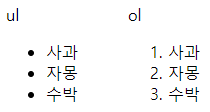
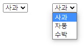
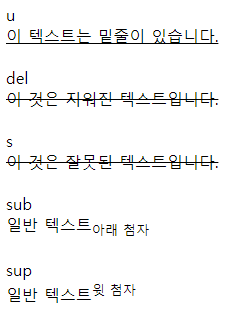
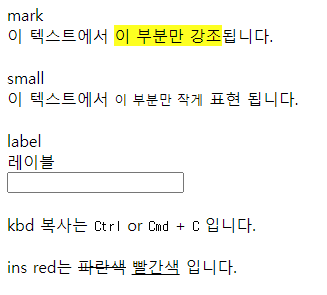
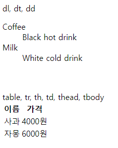

# HTML 기본 1

기존 1일차에 지나간 내용에 조금 더 살을 붙여 다양한 HTML 태그를 직접 사용해봅니다.


HTML의 태그 목록은 https://www.w3schools.com/TAGS/default.ASP 에서 확인 가능합니다.


## 1일차 2장 복습


### h1 ~ h6

헤딩을 표현하기 위한 태그입니다.

h1이 가장 큰 제목이고, h6가 가장 작은 제목입니다.

```html
<h1>This is heading 1</h1>
<h2>This is heading 2</h2>
<h3>This is heading 3</h3>
<h4>This is heading 4</h4>
<h5>This is heading 5</h5>
<h6>This is heading 6</h6>
```


### p 

문단을 표현하기 위한 태그입니다.

block 단위 요소로 세로축 정렬입니다.

```html
<p>이것은 하나의 문단입니다.</p>
```


### br

줄바꿈을 표현하기 위한 태그입니다.

내용을 가지지 않는 태그로 스스로 닫을 수 있습니다.

```html
<p>이것은 하나의 문단입니다.<br/>여기서 부터는 줄이 바뀝니다.</p>
```


### center

내용을 가운데 정렬하기 위한 태그입니다.

```html
<center>
  <p>이 문단은 가운데 정렬 됩니다.</p>
</center>
```


### pre

HTML에서 탭, 엔터, 스페이스 등의 서식을 그대로 표현하기 위한 태그입니다.

```html
<pre>
  이 텍스트는 '       ' 긴 띄어쓰기와 '	'탭
  '
  
  '
  엔터가 그대로 적용됩니다.
</pre>
```


### hr

가로줄을 표현하기 위한 태그입니다.

br처럼 스스로 닫을 수 있습니다.

```html
<hr />
```


### div

구역을 표현하기 위한 태그입니다.

block 단위의 요소를 표현합니다.

```html
<div>
    <h1>
        제목 1
    </h1>
    <p>
        내용 1
    </p>
</div>
<div>
    <h1>
        제목 2
    </h1>
    <p>
        내용 2
    </p>
</div>
```


### span

한개의 글자 구성을 표현하기 위한 태그입니다.

inline 형태의 요소입니다.

```html
<span>이 것은 하나의 내용입니다.</span>
```


### i

이태릭 체를 표현할 때 사용합니다.

```html
<i>italic 글씨체</i>
```


### b

두꺼운 글씨를 표현할 때 사용합니다.

```html
<b>이 것은 두꺼운 글씨입니다.</b>
```


### img

이미지를 표현하기 위한 태그입니다.

```html

```


### input

입력을 받기 위한 태그입니다.

다양한 type을 가질 수 있습니다.

```html
<input type="text" />
<input type="password" />
<!-- ... -->
```


### button

버튼을 표현하기 위한 태그입니다.

```html
<button> 버튼 </button>
```


##### 해당 내용에 대한 문서는 아래 주소에서 확인할 수 있습니다.

https://web.esllo.com/days/day1-2.html


## 새로운 HTML 태그

기존 1일차에 언급하지 않았던 태그에 대해 짚고 넘어갑니다.


### li

리스트의 한 요소을 표현하기 위한 태그입니다.

ul 또는 ol의 자식으로 사용됩니다.

```html
<ul or ol>
	<li>사과</li>
    <li>자몽</li>
    <li>수박</li>
</ul or ol>
```


### ul

순서가 없는 리스트를 표현하기 위한 태그입니다.

```html
<ul>
	<li>사과</li>
    <li>자몽</li>
    <li>수박</li>
</ul>
```


### ol

순서가 있는 리스트를 표현하기 위한 태그입니다.

```html
<ol>
	<li>사과</li>
    <li>자몽</li>
    <li>수박</li>
</ol>
```


##### ol과 ul의 차이는 ol은 숫자형태로, ul은 점 형태로 글머리를 표현합니다.





### a

링크를 표현하기 위한 태그입니다.

href를 사용하여 다른 페이지로 이동할 수 있습니다.

target을 통해 열리는 대상 탭을 지정할 수 있습니다.

```html
<!-- 새 탭에서 열기 -->
<a href="https://www.google.com" target="_blank">구글</a>

<!-- 현재 탭에서 열기 -->
<a href="https://www.cloudflare.com" target="_self">클라우드 플레어</a>

<!-- target="_self" 인 경우 생략할 수 있습니다. -->
<a href="https://www.cloudflare.com">클라우드 플레어</a>
```


### select

선택을 구현하기 위한 태그입니다.

option태그와 함께 사용되며 input처럼 선택된 값을 받기 위해 사용됩니다.

```html
<select>
  <option value="사과">사과</option>
  <option value="자몽">자몽</option>
  <option value="수박">수박</option>
</select>
```




### audio

음성 파일을 표현하기 위한 태그입니다.

기본적으로 기본 플레이어가 자동으로 입혀지며, JS를 통해 직접 플레이어를 구현할 수 있습니다.

다양한 속성을 가지고 있으며 src를 제외한 옵션은 선택사항 입니다.

```html
<audio src="{오디오 파일 주소}" autoplay controls loop muted preload />

<!-- 다양한 브라우저에서 동일한 재생을 위해 여러 확장자를 사용할 수도 있습니다. -->
<audio>
	<source src="{오디오.ogg}" type="audio/ogg" />
    <source src="{오디오.mp3}" type="audio/mp3" />
    브라우저가 오디오를 지원하지 않습니다.
</audio>
```


### video

영상 파일을 표현하기 위한 태그입니다.

audio처럼 플레이어가 입혀지며 JS를 통해 직접 구현할 수 있습니다.

audio와 동일한 속성을 지원하며 추가로 poster라는 미리보기 이미지 링크를 지원합니다.

```html
<video src="{영상 파일 주소}" autoplay controls loop muted preload poster="{이미지 주소}"/>

<!-- 다양한 브라우저에서 동일한 재생을 위해 여러 확장자를 사용할 수도 있습니다. -->
<video>
	<source src="{영상.mp4}" type="video/mp4" />
    <source src="{영상.ogg}" type="video/ogg" />
    브라우저가 비디오를 지원하지 않습니다.
</video>
```


### u

밑줄 그인 텍스트를 표현하기 위해 사용됩니다.

```html
<u> 이 텍스트는 밑줄이 있습니다. </u>
```


### strike  >  del / s

취소선이 그어진 텍스트를 위해 표현하였으나 더이상 사용하지 않습니다.

텍스트가 옳지 않음을 표현하기 위해선 `<s>` 태그를, 삭제된 텍스트를 표현하기 위해선 `<del>` 태그를 사용하세요.

```html
<del>이 것은 지워진 텍스트입니다.</del>
<s>이 것은 잘못된 텍스트입니다.</s>
```


### sub

아랫첨자를 표현하기 위한 태그입니다.

```html
일반 텍스트<sub>아래 첨자</sub>
```


### sup

윗첨자를 표현하기 위한 태그입니다.

```html
일반 텍스트<sup>윗 첨자</sup>
```




### mark

강조하기 위한 태그입니다.

```html
<span> 이 텍스트에서 <mark>이 부분만 강조</mark>됩니다.</span>
```


### small

작은 텍스트를 표현하기 위해 사용됩니다.

```html
<span> 이 텍스트에서 <small>이 부분만 작게</small> 표현 됩니다.</span>
```


### label

특정 input 타입의 레이블을 표현하기 위해 사용됩니다.

```html
<label for="in">레이블</label>
<input type="text" id="in" />
```


### kbd

키보드 키를 표현하기 위해 사용됩니다.

```html
복사는 <kbd>Ctrl</kbd> or <kbd>Cmd</kbd> + <kbd>C</kbd> 입니다.
```


### ins

추가된 텍스트를 표현하기 위해 사용됩니다.

del의 반대의 의미입니다.

```html
red는 <del>파란색</del> <ins>빨간색</ins> 입니다.
```




### form

여러 input을 묶는 태그입니다.

주로 post나 get 전송을 할 때 필요한 input들을 모아주는 역할을 합니다.

```html
<form action="{타겟 전송 주소}" method="{get || post}">
    <input type="text" placeholder="id"/>
    <input type="password" placeholder="pw"/>
    <input type="checkbox" id="autoLogin" />
    <label for="autoLogin">자동 로그인</label>
    <input type="submit" value="로그인" />
</form>
```


### dl / dt / dd

설명(description) 리스트를 위한 태그입니다.

key : value 형태의 데이터를 표현하기 위해 사용합니다.

dl = description list, dt = description term, dd = description details

```html
<dl>
    <dt>사과</dt>
    <dd>사과나무의 열매</dd>
    <dt>자몽</dt>
    <dd>운향과의 상록 소교목</dd>
    
</dl>
```


### table / tr / th / td / thead / tbody

테이블을 표현하기 위한 태그입니다.

table에는 thead와 tbody 영역으로 나뉘며 thead에는 컬럼으로 th가 사용되고, tbody에는 컬럼으로 td가 사용됩니다.

tr은 행(row)로 사용되며, th 와 td는 열(column)로 사용됩니다.

```html
<table>
    <thead>
    	<tr>
        	<th>이름</th>
            <th>가격</th>
        </tr>
    </thead>
    <tbody>
    	<tr>
        	<td>사과</td>
            <td>4000원</td>
        </tr>
        <tr>
        	<td>자몽</td>
            <td>6000원</td>
        </tr>
    </tbody>
</table>
```

