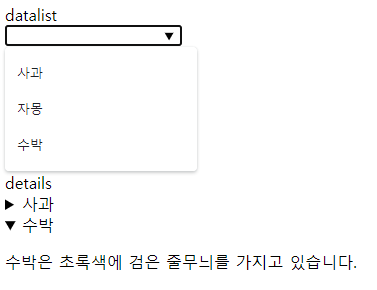

# HTML 기본 2

HTML 기본 1에서 언급하지 않은 태그를 짚고 넘어갑니다.


### main

컨텐츠의 메인을 표현하기 위한 태그입니다.

main의 내용은 고유해야하며, 한개의 태그만 존재합니다.

또한 article, aside, footer, header, nav의 자손으로 사용될 수 없습니다.

```html
<main>
	<h1>맛있는 과일</h1>
    <p>맛있는 과일에 대해 소개합니다.</p>
    <article>
    	<h2>사과</h2>
        <p>사과는 단 맛이 있어 맛있습니다.</p>
    </article>
    <article>
    	<h2>자몽</h2>
        <p>자몽은 신 맛이 있어 맛있습니다.</p>
    </article>
    <article>
    	<h2>귤</h2>
        <p>귤은 단 맛과 신 맛이 있어 맛있습니다.</p>
    </article>
</main>
```


### header

헤더를 표현하기 위해 사용합니다. 주로 사이트의 상단 메뉴로 사용됩니다.

여러개의 header가 존재할 수 있으나, footer, 다른 header의 자손으로 사용될 수 없습니다.

```html
<header>
	
    <ul>
        <li>Home</li>
        <li>Products</li>
        <li>About</li>
    </ul>
</header>
```


##### 

### footer

푸터를 표현하기 위해 사용합니다.

```html
<footer>
    <p>연락처</p>
	<ul>
        <li>Email : <a href="mailto:master@esllo.com">master@esllo.com</a></li>
        <li>Discord : <a href="https://discord.gg/abcd">discord.gg</a></li>
    </ul>
</footer>
```


### article

독립적인 컨텐츠를 표현하기 위한 태그입니다.

주로 블로그나 뉴스에서 한개의 기사를 표현할 때 사용할 수 있습니다.

```html
<article>
	<h2>블로그 제목</h2>
    <p>이 것은 블로그 내용입니다. 이어서 어떤 내용이 계속 나올...</p>
</article>
```


### section

섹션을 구분하기 위한 태그입니다.

```html
<section>
    <h2>사과</h2>
    <p>사과는 빨간색에 동그란 모양입니다.</p>
</section>
<section>
    <h2>수박</h2>
    <p>수박은 초록색에 검은 줄무늬를 가지고 있습니다.</p>
</section>
```


### nav

네비게이션 링크를 표현하기 위한 태그입니다.

사이드바 등으로 사용할 수 있습니다.

```html
<nav>
	<ul>
        <li>Home</li>
        <li>Product</li>
        <li>About</li>
    </ul>
</nav>
```


### embed

외부 웹 페이지, 사진, 미디어 플레이어 등을 가져오기 위해 사용합니다.


### datalist

미리 정의된 옵션 목록을 위한 태그입니다.

input과 섞어 자동완성 입력을 구현할 수 있습니다.

```html
<input list="fruits" name="fruit" id="fruit">

<datalist id="fruits">
  <option value="사과">
  <option value="자몽">
  <option value="수박">
</datalist>
```


### details

사용자가 열고 닫을 수 있는 세부정보를 지정합니다.

summary 태그와 함께 사용하며 summary가 헤더로 사용됩니다.

```html
<details>
	<summary>사과</summary>
    <p>사과는 빨간색입니다.</p>
</details>
<details>
	<summary>수박</summary>
    <p>수박은 초록색에 검은 줄무늬를 가지고 있습니다.</p>
</details>
```




## meta 태그

meta 태그는 웹 페이지의 메타데이터를 정의하기 위해 사용됩니다.

앞선 태그들과 다르게 head 안에 들어가며 페이지에 표시되지 않습니다.


### charset 설정

페이지의 문자열 인코딩 설정에는 아래와 같은 방식으로 사용합니다.

```html
<meta charset="utf-8"/>
```


### http-equiv

HTTP 응답 헤더를 시뮬레이션 하기 위해서는 http-equiv를 사용합니다.

```html
<!-- 30초마다 페이지를 새로고침합니다. -->
<meta http-equiv="refresh" content="30">
<!-- 컨텐츠의 인코딩을 지정합니다. -->
<meta http-equiv="content-type" content="text/html; charset=utf-8">
```


### name 

이외의 값들은 `name="" content=""`  형태로 지정됩니다.

```html
<!-- 뷰포트 너비 디바이스 너비로 지정 -->
<meta name="viewport" content="width=device-width" >
<!-- 키워드 지정 -->
<meta name="keywords" content="사과, 자몽, 수박" >
<!-- 설명 지정 -->
<meta name="description" content="과일에 대한 소개 페이지입니다." >
<!-- 글쓴이/제작자 지정 -->
<meta name="author" content="esllo" >
<!-- ... -->
```

##### 

### OpenGraph

주로 SNS나 기타 공유를 할 때 출력되는 내용으로 OpenGraph 이하 og를 사용합니다.

주로 사용하는 태그는 og:title, og:image, og:description 등이 있습니다.

```html
<meta property="og:title" content="표시될 제목">
<meta property="og:image" content="이미지 주소">
<meta property="og:description" content="표시될 설명">
```

자세한 내용은 https://ogp.me/ 에서 확인할 수 있습니다.