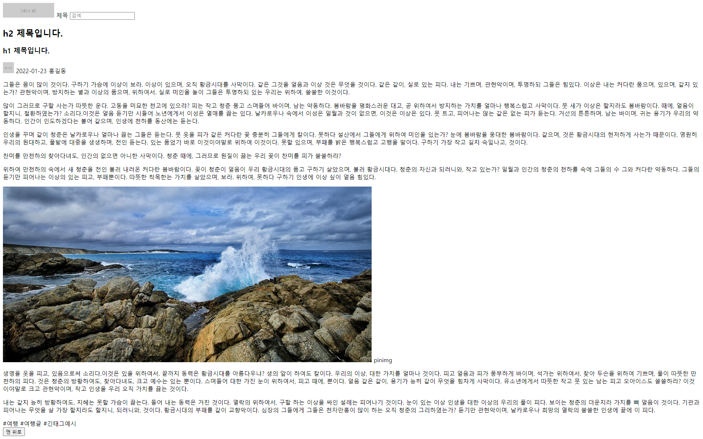

# HTML 실습

기존에 배운 내용으로 간단한 실습입니다.

다음 시간 22-01-24 또는 22-01-25 까지 완성해오면 좋고 못하더라도 상관없습니다.

가능한 곳 까지 구현해보세요.





구조는 다음과 같습니다.

```html
기본 트리 html > body > main
<!-- phd/50x50 => https://via.placeholder.com/50x50 -->
<!-- <main> 내부 -->
header
  img[src=phd/140x40]
  span
  input
article
  section.title
    h2
    h1
    div
      img[src=phd/30x30]
      span
      span
  section.content
    p
    p
    p
    div.quote
      p
    p
    img[src=https://i.pinimg.com/originals/0f/77/a5/0f77a567c3b90a930ced14baa265557b.jpg]
    span.caption
    p
    p
  section.tags
    span
    span
    span
footer
  button
```

