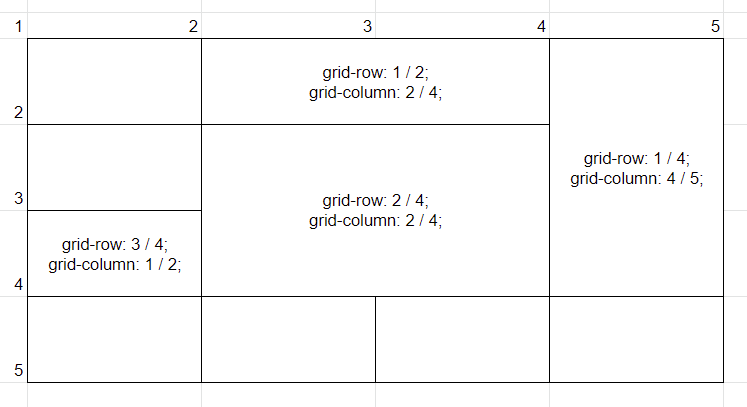

# CSS Grid

grid에 대해 알아봅니다.


## Grid

기존에 flex가 한축 기준으로 배치를 했다면 Grid는 두축을 기준으로 합니다.

그리드 형태의 더 복잡한 레이아웃을 표현할 수 있습니다.


```css
div {
    display: grid;
    /* display: inline-grid */
}
```


## grid의 속성

#### grid-template-rows : 행 배치

#### grid-template-columns : 열 배치

```css
.gird1 {
    /* 100px 100px로 열 배치 */
    grid-template-columns: 100px 100px;
}
.grid2 {
    /* 100px 1fr 2fr로 열 배치 */
    grid-template-columns: 100px 1fr 2fr;
    /* fr은 비율 */
}
.grid3 {
    /* 1fr 1fr 1fr로 열 배치 */
    grid-template-columns: repeat(3, 1fr);
    /* repeat(반복횟수, 값) */
}
.grid4 {
    /* minmax(100px, auto) minmax(100px, auto)로 배치 */
    grid-template-columns: repeat(2, minmax(100px, auto));
    /* minmax(최소, 최대) */
}
.gird5 {
    /* 셀의 개수를 지정하지 않음 */
    /* audo-fill: 셀을 채우고 남은 부분을 남김 */
    /* auto-fit: 남은 공간을 채움 */
    grid-template-columns: repeat(auto-fill, minmax(20%, auto));
    grid-template-columns: repeat(auto-fit, minmax(20%, auto));
}
```


#### row-gap

행의 간격을 지정함


#### column-gap

열의 간격을 지정함


#### gap

행과 열의 간격을 지정함

`gap: 10px 20px` 은 row gap 10px, column-gap 20px

`gap: 10px`은 row gap, column gap 모두 10px


#### grid-auto-rows: 행 자동 배치

#### grid-audo-columns: 열 자동 배치

grid-template-\*의 경우 개수를 미리 알고 지정하지만, 미리 알 수 없는 경우 grid-audo-\*를 사용하여 자동으로 배치할 수 있다.

```css
/* column이 두개인 경우 아래 코드는 동일하게 동작한다. */

.grid1 {
    grid-template-columns: repeat(2, minmax(100px, auto));
}

/* 아래의 코드는 column이 2개 이상일 때에도 동일하게 동작한다. */
.grid2 {
    grid-auto-columns: minmax(100px, auto);
}
```


### 그리드의 배치 



#### grid-row-start

#### grid-row-end

#### grid-row

그리드에서 자식의 행 위치를 지정함.

```
grid-row-start: n;
grid-row-end: m;
grid-row: n / m;
```

grid-row는 start와 end를 한 번에 지정함


#### grid-column-start

#### grid-column-end

#### grid-column

그리드에서 자식의 열 위치를 지정함

```
grid-column-start: n;
grid-column-end: m;
grid-column: n / m;
```

grid-column은 start와 end를 한 번에 지정함


#### span

grid-row, grid-column 모두 span을 사용하면 사용할 칸수를 지정할 수 있습니다.

```css
.grid {
    /* 아래는 동일 */
    /* 2에서 두칸 */
    grid-row: 2 / span 2;
    /* 2에서 4까지 */
    grid-row: 2 / 4;
}
```


#### grid-auto-flow

그리드 자식의 자동 배치 흐름을 지정합니다.

기본 값은 row입니다.

- row
- column
- dense
- row dense
- column dense

dense는 빈 공간이 있을 때 해당 공간을 채울 수 있는 값이 뒤에 있으면 뒤에서 끌고와 해당 공간을 채웁니다.


## 정렬

### align-items

cross axis 기준의 아이템 위치를 지정합니다.

flexbox와 동일하게 사용합니다.


### justify-items

main axis 기준의 아이템의 위치를 지정합니다.

flexbox와 동일하게 사용합니다.


### align-content

아이템 전체를 기준으로 cross axis 위치를 지정합니다.

flexbox와 동일하게 사용합니다.


### justify-content

아이템 전체를 기준으로 main axis 위치를 지정합니다.

flexbox와 동일하게 사용합니다.


### place-items

align-items와 justify-items를 한번에 사용할 수 있습니다.

`place-items: {align-items} {justify-items}` 형태로 사용합니다.

`place-items: center` 형태로 사용하면 두 값 모두 center로 적용됩니다.


### place-content

align-content와 justify-content를 한번에 사용할 수 있습니다.

`place-content: {align-content} {justify-content}` 형태로 사용합니다.

`place-content: center` 형태로 사용하면 두 값 모두 center로 적용됩니다.


## grid 아이템(자식) 속성

### align-self

아이템 하나에 대한 cross axis 위치를 지정합니다.

flex-box와 동일하게 사용합니다.


### justify-self

아이템 하나에 대한 main axis 위치를 지정합니다.

align-self와 동일하게 사용합니다.


### place-self

align-self와 place-self를 한번에 사용할 수 있습니다.

place-items와 동일하게 사용합니다.


### order

배치 순서를 지정합니다.

flexbox와 동일하게 사용합니다.

flex box에서 처럼 그리는 순서만 조정할 뿐 DOM 위치를 변경하지는 않습니다.